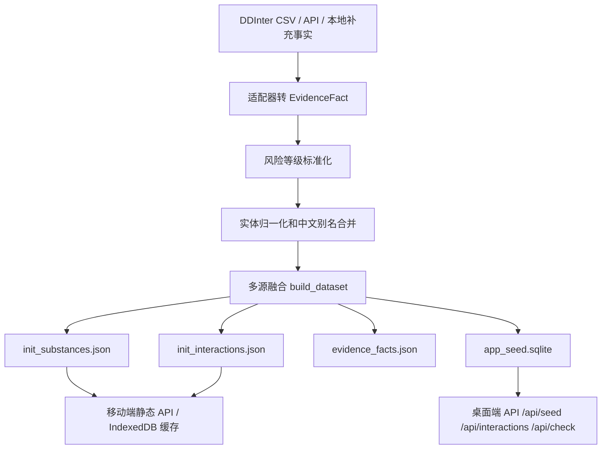

# 个人多维动态代谢与安全管理系统整体方案

更新时间：2026-05-17  
当前阶段：桌面端本地原型已可运行，移动端迁移前验证数据、搜索、日志、冲突检查和动态代谢曲线。

## 1. 当前构建快照

当前 `build/manifest.json` 统计：

| 项目 | 数量 |
| :--- | ---: |
| `substances_core` | 1941 |
| `interactions_core` | 160235 |
| `evidence_facts` | 162180 |
| 数据集版本 | 2026-05-17 |

当前桌面端地址：

```text
http://127.0.0.1:8765/
```

当前桌面端能力：

- 药物/物质中文和英文检索。
- 本地日志新增、单条删除、全清。
- 活跃时间窗内 DDI/DFI 两两冲突检查。
- Canvas 绘制动态代谢曲线。
- 摄入时间可手动指定；曲线横轴按最早活跃摄入时间到未来 12 小时绘制，并标出当前时间。
- 体重、身高、体脂率、代谢表型、给药途径、胃部状态参与 PopPK 修正。
- 乙醇按饮酒体积和酒精度换算为纯乙醇克数。
- 设置页可手动拉取非商业公开源候选事实，并一键重建本地库。
- Tandospirone、茶多酚/EGCG 已通过本地补充事实进入 substance 库。

说明：如果在设置页拉取了公开源候选事实并点击“重建本地库”，统计会增加。当前本机已试拉 RxNav `ibuprofen`，重建后为 `1992` 个物质、`160235` 条相互作用、`162287` 条证据事实。

## 2. 数据源总表

这里按“当前是否真正进入本地种子库”区分。`connected_api` 表示代码已经有适配器，不等于该源已经批量合并进当前 `build/app_seed.sqlite`。

### 2.1 当前已经进入本地构建的数据源

| 数据源 | 当前状态 | 层级 | 本地位置/接入方式 | 当前用途 | 边界 |
| :--- | :--- | :--- | :--- | :--- | :--- |
| DDInter 2.0 | 已导入 | `CuratedDB` | `data/raw/ddinter/ddinter_code_*.csv`，命令 `import-ddinter` | 当前主 DDI/DFI 冲突库，提供 160235 条 interactions | 以 DDInter 原始风险等级和机制文本为主，不替代临床处方系统 |
| 中文别名覆盖表 | 已导入 | `ManualReview` | `data/overrides/drug_zh_aliases.csv` | 给 DDInter 英文物质补中文名和常见别名，例如乙醇/酒精 | 只做检索和显示，不作为安全证据 |
| 本地补充事实 | 已导入 | `Literature` | `data/overrides/supplemental_facts.json` | 补 DDInter 长尾缺口，例如 Tandospirone、茶多酚/EGCG | 多数是候选事实，不能降级已知高风险 |
| 演示 fixture | 可选 | `Fixture` | `data/fixtures/evidence_facts.json` | 离线单元测试和最小 demo | 不用于真实主库 |

### 2.2 已实现适配器，但默认未批量合入当前构建

| 数据源 | 官方地址 | 当前状态 | 层级 | 适配器命令 | 输出事实类型 | 当前用途 |
| :--- | :--- | :--- | :--- | :--- | :--- | :--- |
| openFDA Drug Label | https://open.fda.gov/apis/drug/label/ | `connected_api` | `Regulatory` | `fetch-openfda` | `source_text` | 抓 FDA 标签段落，后续由规则/LLM/人工复核抽 PK、DDI、DFI |
| DailyMed SPL | https://dailymed.nlm.nih.gov/dailymed/app-support-web-services.cfm | `connected_api` | `Regulatory` | `fetch-dailymed` | `substance_identity` / 标签元数据 | SPL 监管标签入口，完整 XML 段落抽取待扩展 |
| RxNav / RxNorm | https://lhncbc.nlm.nih.gov/RxNav/APIs/RxNormAPIs.html | `connected_api` | `Regulatory` | `fetch-rxnav` | `substance_identity` | RxCUI、NDC、标准药名映射；DDI API 已下线，不再作为冲突源 |
| ChEMBL | https://www.ebi.ac.uk/chembl/ | `connected_api` | `CuratedDB` | `fetch-chembl` | `substance_identity` | 化学实体、分子属性、候选物化信息 |
| PsychonautWiki | https://api.psychonautwiki.org | `connected_api` | `Community` | `fetch-psychonautwiki` | `substance_identity` / `pharmacokinetics` | 社区 ROA、剂量、持续时间候选源，只补盲 |

桌面端“数据源设置”面板已经给这些源提供更新按钮。openFDA、DailyMed、RxNav、ChEMBL 需要输入关键词；PsychonautWiki 可直接拉取一批社区候选。拉取结果先保存到 `data/optional/public_facts.json`，点击“重建本地库”后合入 `build/app_seed.sqlite`、`init_substances.json`、`init_interactions.json` 和 `evidence_facts.json`。

### 2.3 已登记，待本地文件适配器或下载流程

| 数据源 | 官方地址 | 当前状态 | 层级 | 计划用途 | 接入要求 |
| :--- | :--- | :--- | :--- | :--- | :--- |
| FooDrugs | https://zenodo.org/records/8192515 | `local_file_adapter_pending` | `Signal` | 药食冲突 DFI 候选信号，文本挖掘和组学评分 | 下载 SQL/CSV 后本地解析；只能进候选层 |
| OnSIDES | https://github.com/tatonetti-lab/onsides | `local_file_adapter_pending` | `Signal` | FDA 标签 NLP 副作用信号 | 下载 release 数据，转成 `source_text` 或 `adverse_event_signal` |
| PharmGKB / ClinPGx | https://api.pharmgkb.org/ | `download_adapter_pending` | `Guideline` | PGx、CPIC、基因表型到代谢修正 | 需要按 PharmGKB/ClinPGx 下载包和许可边界接入 |

### 2.4 已登记，但必须授权后才能用于产品

| 数据源 | 官方地址 | 当前状态 | 层级 | 用途 | 限制 |
| :--- | :--- | :--- | :--- | :--- | :--- |
| DrugBank | https://go.drugbank.com/ | `license_required` | `LicensedCommercial` | PK/PD、DDI、DFI、靶点、机制 | 商业或面向用户系统集成需授权，不能直接打包 |
| FDB MedKnowledge | https://www.fdbhealth.com/ | `license_required` | `LicensedCommercial` | 临床级药物安全、患者提示、EHR 级 CDSS | 企业授权，禁止未授权分发 |
| Medi-Span | https://www.wolterskluwer.com/en/solutions/medi-span/medi-span/drug-data | `license_required` | `LicensedCommercial` | 临床筛查、药品数据、相互作用 | 企业授权，封闭数据 |
| Certara DIDB | https://www.certara.com/drug-interaction-database-didb/ | `license_required` | `LicensedCommercial` | 研发级定量 DDI、PBPK 支撑 | 企业授权，不能作为开源包分发 |

### 2.5 早期方案提过但当前代码未接入

| 数据源 | 当前状态 | 说明 |
| :--- | :--- | :--- |
| TripSit Combo Matrix | 未接入 | 早期方案提过；当前主相互作用库改为 DDInter 2.0。本项目后续可以加 TripSit 作为 `Community` 或 `CuratedDB` 辅助源，但不能覆盖更高可信来源。 |

## 3. 数据可信度和安全等级

### 3.1 来源层级

当前代码中的来源层级排序：

```text
LicensedCommercial / Guideline / Regulatory
> Label / ManualReview
> CuratedDB
> Literature
> Signal
> Community
> Fixture
```

原则：

- 监管标签、指南和授权商业数据优先级最高。
- DDInter 作为当前主库，属于已策展数据库。
- 文献和本地补充事实可以补长尾，但必须标注可信度。
- 社区数据和 NLP 信号只作为候选，不能把高风险降级。

### 3.2 可信度

```text
High > Medium > Low > Unknown
```

每条 `EvidenceFact` 必须记录：

- `source_tier`
- `confidence`
- `source_name`
- `source_url`
- `evidence_quote`
- `extraction_method`
- `review_status`
- `use_policy`

### 3.3 风险等级

当前统一风险等级：

| 内部等级 | 临床含义 | UI 动作 |
| :--- | :--- | :--- |
| `Contraindicated` | 禁忌/极高危 | 最高优先级报警 |
| `Major` | 严重风险 | 建议避免或修改方案 |
| `Moderate` | 中度风险 | 密切监测 |
| `Minor` | 轻微风险 | 提示、错峰、谨慎 |
| `NoKnownClinicalSignificance` | 未见明确临床意义 | 默认静默 |
| `Unknown` | 资料不足 | 显示不确定；绝不当作安全 |

核心规则：`Unknown != Safe`。没有资料只能显示“不确定”，不能显示“安全”。

## 4. 本地数据模型

### 4.1 EvidenceFact

所有来源先转成统一证据事实：

```json
{
  "fact_type": "substance_identity | pharmacokinetics | enzyme_relation | drug_interaction | food_interaction | source_text",
  "subject_ids": ["substance_a", "substance_b"],
  "claim": {},
  "risk_level": "Unknown",
  "confidence": "Medium",
  "source_tier": "CuratedDB",
  "source_name": "DDInter 2.0",
  "source_url": "https://ddinter2.scbdd.com/download/",
  "extraction_method": "csv_import",
  "review_status": "machine_checked",
  "use_policy": "evidence_source"
}
```

### 4.2 导出表

移动端和桌面端使用的核心输出：

| 输出 | 用途 |
| :--- | :--- |
| `build/init_substances.json` | 移动端/桌面端可用的 substance 种子 JSON |
| `build/init_interactions.json` | 移动端/桌面端可用的 interaction 种子 JSON |
| `build/evidence_facts.json` | 溯源、调试、详情页证据 |
| `build/app_seed.sqlite` | 桌面端快速检索和冲突检查 |
| `build/manifest.json` | 数据集版本和数量统计 |
| `build/source_status.json` | 当前数据源状态快照 |

### 4.3 SQLite 核心表

桌面端当前读取：

- `substances_core`
- `interactions_core`
- `evidence_facts`

移动端 PWA 当前使用 IndexedDB 缓存静态 API、journal、settings 和 profile。若后续做原生 Room/SQLite，可映射这三类表，并额外增加：

- `substances_override`：用户自定义覆盖，不覆盖官方只读库。
- `journal_entries`：摄入日志。
- `user_profiles`：体重、身高、体脂、代谢表型快照。
- `sync_metadata`：后续 WebDAV/Syncthing/PouchDB 同步元信息。

## 5. ETL 和融合流程



融合规则：

- 同一 interaction 的多个来源按风险最高值合并。
- 非 `Unknown` 风险优先于 `Unknown`。
- 低可信度或社区来源不能把更高风险来源降级。
- 冲突来源会标记 `conflict_status=conflicting`。
- 机制和说明文本保留为合并 note，详情页可追溯到 `evidence_refs`。

## 6. 桌面端实现

### 6.1 文件位置

| 文件 | 作用 |
| :--- | :--- |
| `desktop_app/server.py` | 无第三方依赖 HTTP API 和静态文件服务 |
| `desktop_app/config.py` | 路径、source 配置、ETL import 路径设置 |
| `desktop_app/services/` | public source 同步、重建任务、job 状态、安全/path 校验 |
| `desktop_app/static/index.html` | 单页 UI |
| `desktop_app/static/app.js` | 搜索、日志、冲突检查、PopPK 曲线 |
| `desktop_app/static/styles.css` | AMOLED 黑色 UI |

### 6.2 API

| API | 作用 |
| :--- | :--- |
| `/api/seed` | 返回 manifest 和 substance 精简列表 |
| `/api/interactions?q=&limit=` | 服务端相互作用检索，避免浏览器加载全部大表 |
| `/api/check?ids=a,b,c` | 当前活跃 substance 两两冲突检查 |
| `/api/sources` | 当前数据源状态 |
| `/api/source-update?key=&term=&limit=` | 拉取非商业公开源候选事实，写入 `data/optional/public_facts.json` |
| `/api/rebuild` | 用 DDInter、本地补充事实和可选公开源候选事实重建本地库 |
| `/health` | 服务健康检查 |

### 6.3 中文和缓存处理

- HTML 使用 `<meta charset="utf-8">`。
- JS/CSS/HTML 响应头带 `charset=utf-8`。
- API JSON 使用 UTF-8 发送。
- 静态和 API 响应带 `Cache-Control: no-store`，避免刷新后加载旧 JS。

## 7. 动态代谢模型

### 7.1 普通口服/非瞬时途径

桌面端采用一室一阶吸收模型：

```text
C(t) = F * D * ka / (Vd * (ka - ke)) * (e^(-ke*t) - e^(-ka*t))
```

变量：

- `D`：录入剂量。
- `F`：生物利用度因子，由给药途径和胃部状态修正。
- `ka`：吸收速率常数，由起效时间、给药途径、胃部状态估算。
- `ke`：消除速率常数，`ke = ln(2) / t1/2`。
- `Vd`：表观分布容积，由体重、体脂率、脂溶性标签修正。

### 7.2 瞬时途径

给药途径为 `IV` 或瞬时吸收时降级为消除模型：

```text
C(t) = F * D / Vd * e^(-ke*t)
```

### 7.3 个体修正维度

当前参与修正：

- 体重 kg。
- 身高 cm。
- 体脂率 %。
- 代谢表型：UM / EM / PM。
- 给药途径：口服、舌下、鼻腔、经皮、静脉/瞬时、其他。
- 胃部状态：完全空腹、正常/少量进食、高脂重餐。
- 物质水溶性/脂溶性。

### 7.4 乙醇模型

乙醇不是普通半衰期曲线，桌面端单独处理：

```text
纯乙醇 g = 酒量 ml × 酒精度 %vol × 0.789
```

趋势模型：

- 分布容积按体脂修正后的总身体水估算。
- 消除按近似零级消除绘制。
- 输出用于个人趋势日志，不用于判断驾驶、急救或法律场景。

## 8. 当前运行命令

### 8.1 重新生成真实库

```powershell
$env:PYTHONPATH="src"
python -m metabolic_safety_etl.cli import-ddinter --input-dir data\raw\ddinter --out build --zh-aliases data\overrides\drug_zh_aliases.csv --supplement-facts data\overrides\supplemental_facts.json
```

### 8.2 启动桌面端

```powershell
$python=(Get-Command python).Source
$p=Start-Process -FilePath $python -ArgumentList @('desktop_app\server.py','8765') -WorkingDirectory (Resolve-Path '.').Path -WindowStyle Hidden -RedirectStandardOutput build\desktop_server.out.log -RedirectStandardError build\desktop_server.err.log -PassThru
Set-Content build\desktop_server.pid $p.Id
```

前台启动也支持：

```powershell
$env:PYTHONPATH="src"
python desktop_app/server.py
# 或
python -m desktop_app.server
```

### 8.3 停止桌面端

```powershell
Stop-Process -Id ([int](Get-Content build\desktop_server.pid)) -Force
```

### 8.4 测试

```powershell
node --check desktop_app\static\app.js
$env:PYTHONPATH="src"
python -m unittest discover -s tests
python -m unittest tests.test_static_api
python -m compileall -q desktop_app src tests
```

移动端要求 Node >=20.19，聚焦测试示例：

```powershell
cd mobile_pwa
npm test
npm run build
npx vitest run src/lib/api.test.ts
npx vitest run src/domain/safety.test.ts src/services/risk-service.test.ts
```

### 8.5 查看数据源状态

```powershell
$env:PYTHONPATH="src"
python -m metabolic_safety_etl.cli sources --out build\source_status.json
```

## 9. 移动端落地方案

当前已落地 `mobile_pwa/`：React 19 + Vite 7 + TypeScript，目录包括 `src/pages/`、`src/components/`、`src/hooks/`、`src/repositories/`、`src/services/`、`src/domain/`、`src/lib/`、`src/types.ts` 和 `src/styles/`。PWA 使用 IndexedDB 保存静态 JSON 缓存、详情 bundle、journal、settings 和 profile；`App.tsx` 负责顶层 shell 和依赖装配。

隐私边界：远程 GitHub/Cloudflare 静态 API 只用于 public seed/search/detail JSON 和离线包，不上传个人参数、摄入日志、剂量史、二维码迁移 payload 或本地风险推断。二维码/文本迁移 payload 含个人参数和日志，只用于用户主动复制/扫码/导入。实时 openFDA FAERS fallback 会把物质名/别名发往 openFDA，应保持用户可感知/可关闭，结果仅作为低可信候选信号。

### 9.1 Android 原生备选方案

| 层 | 方案 |
| :--- | :--- |
| UI | Kotlin + Jetpack Compose |
| 本地库 | Room / SQLite |
| 曲线 | Compose Canvas / Android Canvas |
| 数据导入 | Assets 内置 `init_substances.json` 和 `init_interactions.json` |
| 日志 | Room 本地表，保存当时的 profile 快照 |
| 同步 | WebDAV / Syncthing 文件级同步优先，后续 PouchDB/CouchDB 类增量同步作为高级方案 |

### 9.2 PWA 轻量方案

| 层 | 方案 |
| :--- | :--- |
| UI | Vue/React + TypeScript |
| 本地库 | IndexedDB/localForage |
| 曲线 | HTML Canvas |
| 同步 | PouchDB/CouchDB 或 WebDAV 文件同步 |

### 9.3 移动端必须保留的原则

- 核心库只读，用户覆盖单独存表。
- 上游核心库可整体替换，不能破坏用户日志。
- 历史日志保存当时的剂量、单位、profile、模型参数快照。
- 相互作用提示必须显示来源层级、可信度和 `Unknown` 警告。
- 本地密钥和数据库不得上传公有云。

## 10. 下一步优先级

| 优先级 | 任务 | 原因 |
| :--- | :--- | :--- |
| P0 | 完善实体归一化：RxCUI、PubChem CID、ChEMBL ID、DDInter ID 同表 | 避免同一药物多 ID 导致冲突漏检 |
| P0 | 建立 substance 详情页，展示来源、可信度、PK/PD、CYP 标签 | 用户必须知道数据从哪里来 |
| P1 | FooDrugs 本地 SQL/CSV 适配器 | 补药食冲突长尾 |
| P1 | PharmGKB/ClinPGx 下载包适配器 | 支撑 CYP2D6、CYP2C19 等个体化代谢 |
| P1 | openFDA/DailyMed 标签段落结构化抽取 | 把监管文本变成可审查候选事实 |
| P2 | 原生 Android Room schema 和冷启动灌库 | 仅在需要原生客户端时推进；当前移动端为 PWA + IndexedDB |
| P2 | 本地备份和同步策略 | 支撑长期个人日志 |

## 11. 安全声明

本项目当前是本地个人日志和数据工程原型，不是医疗器械级临床决策支持系统。任何药物停用、加量、联用、替换都必须由医生或药师确认。系统输出的 `Unknown` 只表示资料不足，不表示安全。


## ????????GitHub Actions + GitHub Pages

?????????????? openFDA?DailyMed?ChEMBL ?????????????????? JSON API?

1. GitHub Actions ??????? ETL?????????/??????
2. `export-static-api` ??????? `manifest`???????????????????????????
3. GitHub Pages ??????????????????????????????
4. ?? App ??????????????????????????????? JSON?

??????? `docs/REMOTE_STATIC_API.md`?
